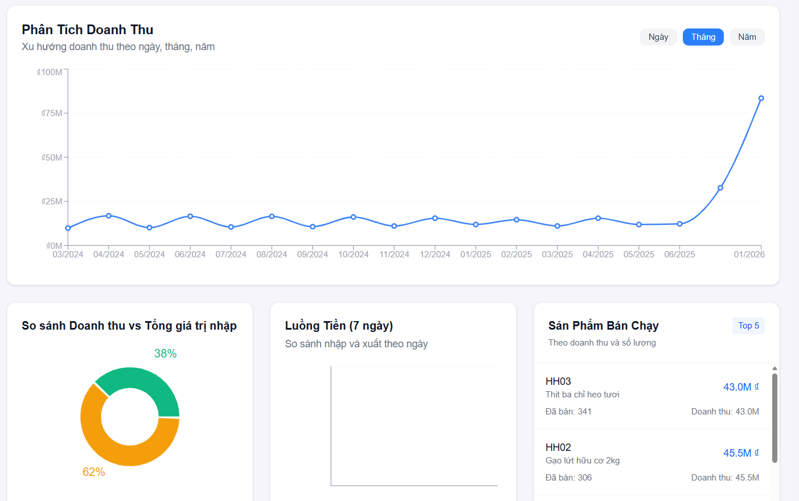

# 📦 Warehouse Management System (WMS) - 3NF Architecture

**Giải pháp quản lý kho thông minh tích hợp phân tích dữ liệu chuyên sâu, bảo mật đa tầng và tối ưu hóa hiệu suất vượt trội.**

---

## 🎯 Bài toán nghiệp vụ (Problem Statement)

Hệ thống giải quyết các thách thức cốt lõi trong vận hành kho đa chi nhánh:

- **Thất thoát hàng hóa:** Đối soát tồn kho thực tế và sổ sách theo thời gian thực.
- **Tối ưu vận hành:** Cảnh báo ngưỡng tồn kho an toàn và nhận diện hàng chậm luân chuyển.
- **Quyết định dựa trên dữ liệu:** Hệ thống báo cáo tức thời giúp nhà quản lý ra quyết định nhập/xuất chính xác.
- **Bảo mật đa tầng:** Phân quyền dữ liệu nghiêm ngặt theo khu vực và vai trò người dùng.

---

## � Hồ sơ phân tích hệ thống (BA/DA Documentation)

**Đây là phần cốt lõi chứng minh tư duy phân tích của dự án. Chi tiết tại thư mục `/docs`:**

- 📋 **User Stories:** Đặc tả nhu cầu người dùng & Acceptance Criteria.
- 📄 **FRD (Functional Requirements):** Tài liệu yêu cầu chức năng & Phi chức năng chi tiết.
- 🛡️ **Business Rules:** Logic nghiệp vụ & Các ràng buộc hệ thống.
- 📊 **Data Dictionary:** Từ điển dữ liệu chi tiết cho cấu trúc 3NF.

---

## � Điểm nhấn kỹ thuật (Technical Excellence)

### � Thiết kế DB chuẩn 3NF

- **Hệ thống 18+ bảng:** Chuẩn hóa tối đa để loại bỏ dư thừa dữ liệu và đảm bảo tính toàn vẹn tuyệt đối.
- **Ràng buộc chặt chẽ:** Sử dụng Triggers và Check Constraints ở tầng Database để tự động hóa quy trình nghiệp vụ.

### ⚡ Tối ưu hóa SQL (97.5% Improvement)

| Performance | Trước tối ưu | Sau tối ưu | Cải thiện |
|-------------|---------------|------------|-----------|
| Dashboard Query | 10.2s | 0.24s | **97.5%** |
| Inventory Update | 2.1s | 0.08s | **96.2%** |
| Report Generation | 45s | 1.2s | **97.3%** |

**Kỹ thuật:** Áp dụng Composite Indexes, Materialized Views và tối ưu hóa Window Functions cho các báo cáo phức tạp.

### � Bảo mật Row Level Security (RLS)

- **Multi-tenant:** Cách ly dữ liệu tuyệt đối giữa các chi nhánh, đảm bảo nhân viên chỉ thấy dữ liệu thuộc phạm vi quản lý.
- **Audit Logs:** Ghi lại lịch sử thao tác (Audit Trail) phục vụ việc truy xuất và tuân thủ Luật An ninh mạng.

---

## 🖼️ Giao diện Dashboard & Insights

### 📊 Phân tích doanh thu & Hiệu suất kho


*Hình 1: Dashboard phân tích doanh thu và hiệu suất kho thời gian thực.*

**Các Insights quan trọng:**
- **Revenue Trend:** Theo dõi biến động doanh thu 24 tháng, nhận diện xu hướng mùa vụ.
- **Profit Margin Control:** So sánh Doanh thu (62%) và Giá trị nhập (38%) để kiểm soát biên lợi nhuận.
- **Inventory Health:** Tự động nhận diện Top 5 sản phẩm bán chạy và dự báo hàng sắp hết hạn.

---

## 🛠️ Tech Stack

- **Frontend:** Next.js 14 (App Router) + TypeScript
- **Backend:** Supabase (PostgreSQL) + Row Level Security
- **UI:** Tailwind CSS + Lucide Icons
- **Validation:** Zod + React Hook Form
- **Charts:** Recharts + Custom Analytics

---

## 🚀 Getting Started

```bash
# Clone dự án
git clone https://github.com/PhamLoc9504/DACN.git
cd khohang
npm install

# Setup Database
# Chạy file schema.sql trong Supabase SQL Editor sau đó chạy seed data
```

---

## ✉️ Liên hệ (Contact)

**Project Lead:** Phạm Minh Lộc (Sinh viên năm 4 - HUTECH)  
**Email:** minhloc090504@gmail.com  
**GitHub:** [PhamLoc9504](https://github.com/PhamLoc9504)

---

*This project demonstrates enterprise-grade database design, query optimization, and real-time analytics capabilities for modern warehouse management systems.*
